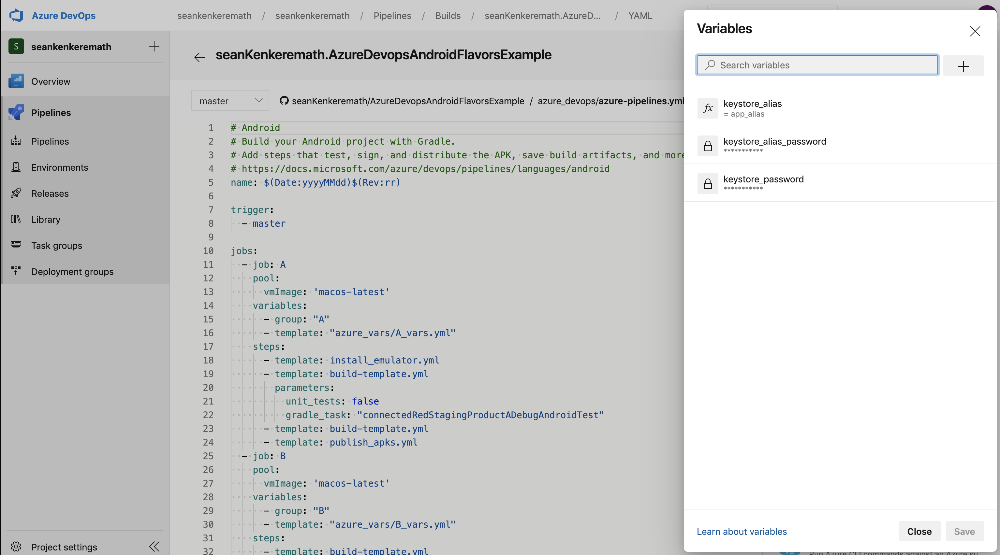
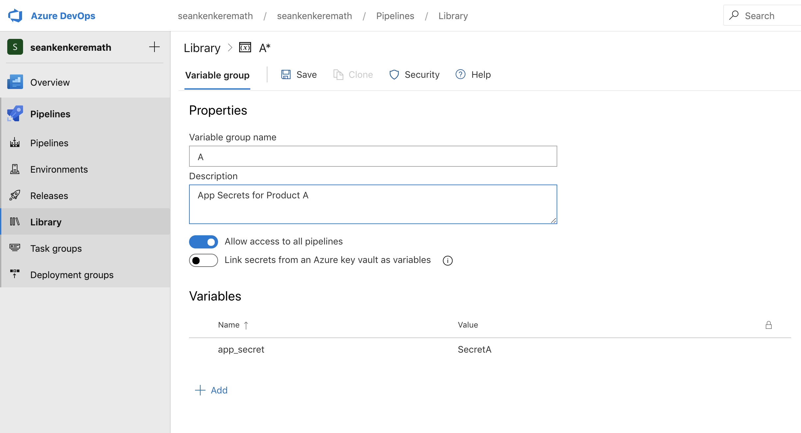

This project is a simple example of how to implement parallel jobs in Azure Devops to support an arbitrary number of Gradle flavors and build variants of an Android app. It also shows how we would flavorize both sensitive and non-sensitive variant-specific properties.

# Pipeline Setup

## Fork this repo

To run a pipeline on your own personal Dev Ops instance, you will need to own the repo.

## Create a new Pipeline in Dev Ops to run the project

In Azure Devops, go to Pipelines -> New Pipeline -> Select your VCS -> select the repo -> Existing Azure Pipelines YAML file -> Branch = `master` branch, Path = `azure_devops/azure-pipelines.yml` -> Continue -> Run

The pipeline should fail. This is because our pipeline needs a bit of configuring on the web side which we will cover soon.

# Gradle flavor dimensions

This guide assumes you understand the basics of Gradle flavor dimensions and how they pertain to Android builds. Some documentation around this can be found [here](https://developer.android.com/studio/build/build-variants)

## Our flavor dimensions

In our example, we have 3 flavor dimensions, `product`, `color`, `environment`.

* `product (productA, productB, productC)` : Which brand we are building. In our example we display a url on the screen defined via a Gradle build config field under each product flavor definition. We also use an Android resource override per product flavor to change the app's name.
* `color (red, green, blue)`: A simple dimension that changes the color of our Hello World text. We do this by overriding the Android color resource used on our TextView for each color dimension.
* `environment (staging, production)`: We use this to determine whether "/staging" or "/prod" is appended to our base url. We do this through a Gradle build config field. We are able to access these statically in our code (see MainActivity).

### Example: redProductCProduction and greenProductAStaging

 

## Choosing our flavor variants

By default, if you run `./gradlew assemble`, it will build every possible combination of your flavors along with every build variant (debug/release by default). This is often not desirable since it can seriously slow down our builds. Gradle allows you to target a specific variant or flavor such as with `./gradlew assembleDebug` or `./gradlew assembleStaging`, but it will still build every possible combination of apks on top of that. Gradle will also let you build a specific combination of flavors such as `./gradlew assembleBlueStagingProductA`. However, it will only let you do this if you supply a value for every flavor dimension. For instance, you cannot do `./gradlew assembleBlueProductA`. Also, even if you build a specific combination, Gradle will still try to configure each build variant. If you have enough dimensions, the sheer number of combinations can make your builds time out.

We can get around some of these limitations using the `variantFilter` block in Gradle (see the app-level build.gradle). This allows us to conditionally ignore builds based on the current flavor/variant combination. In our example we have created a Gradle property to control what combinations are built per product. For instance:

`/.gradlew assemble -PactiveEnvironments=staging,production -PactiveProducts=productA -PactiveColors=blue,green`

will build the release/debug variants for Product A with every combination of staging/production and blue/green.

# The Azure Devops pipeline

All of the YAML files that configure Azure Devops are in the `/azure_devops` directory. Our main pipeline is `azure-pipelines.yml`. This file creates a job per product (A, B, and C) that can be run in parallel and use a single parameterized build template (`build-template.yml`) file. The product-specific parameters for each job are defined in the `variables` block using a combination of static YAML files (in the `/azure_devops/azure_vars` directory) and secret variable groups hosted on Azure Devops.

For instance:

```
  - job: B
    pool:
      vmImage: 'macos-latest'
    variables:
      - group: "B"
      - template: "azure_vars/B_vars.yml"
    steps:
      - template: build-template.yml
      - template: publish_apks.yml
```
This is the job to build Product B. The only difference between this job and the one to build Product C is that the variables are coming from a different hardcoded YAML file and a different secret variable group called "B". Product A contains some additional steps to run UI tests which we will cover later.

The contents of `B_vars.yml` looks like:

```
variables:
  apk_suffix: 'B'
  active_colors: 'blue,red'
  active_environments: 'production'
  active_products: 'productB'
```

The variables we define here tell us which flavor combinations we want built for Product B as well as an alias for our build artifacts. Those variables are then referenced in our reusable build template.

## Secret Variables

None of the product-specific variables we have defined in YAML files contain sensitive information because these files are committed to the repo. However, inevitably sensitive things like credentials, API keys, etc will be needed at build time. These can be configured in the Azure Devops web interface and referenced in our pipeline just like any other variable. For instance, this is how we are injecting our `app_secret` Gradle build config field and also handling our keystore signing in the `publish_apks.yml` file.

Variables can be configured in Devops by editing the pipeline and clicking the "Variables" button. This will apply that variable to any job that is run. For secret variables that must differ per product, we can create secret variable groups.



More information about variables can be found [here](https://docs.microsoft.com/en-us/azure/devops/pipelines/process/variables?view=azure-devops&tabs=yaml%2Cbatch)

## Secret Variable Groups

To create a variable group in Devops, click the "Library" tab in the main navigation and under the "Variable Groups" tab click the button to add a new variable group. Each variable group can be given a name, and if that group name is referenced in a pipeline using `group`, all variables in that group will be applied.

You can see how our job "B" is expecting a corresponding variable group "B":

```
  - job: B
    pool:
      vmImage: 'macos-latest'
    variables:
      - group: "B"
      - template: "azure_vars/B_vars.yml"
    steps:
      - template: build-template.yml
      - template: publish_apks.yml
```

In our example, the only variable we are defining in our variable groups is `app_secret` which will vary based on the product. To run the pipeline, you will need to create three variable groups -- "A", "B", and "C". Each variable group only needs to contain a variable called `app_secret` with any value.

At the bottom, make sure the "Allow access to all pipelines" box is toggled on and click Save. Alternatively, permission can be granted per pipeline for these variable groups.




More information about variable groups can be found [here](https://docs.microsoft.com/en-us/azure/devops/pipelines/library/variable-groups?view=azure-devops&tabs=yaml)

## Signing Credentials

Azure Devops also lets you host files securely in the web interface. We can use this to store our Android Keystore file, and we can either use a global secret variable or a product-specific variable group to define the credentials depending on whether our credentials vary based on product.

Generate a keystore with whatever keystore alias and passwords you'd like and name it `keystore.keystore`. Then under "Library", click the Secure files tab to upload that keystore. At the bottom, make sure the "Authorize for use in all pipelines" box is toggled on. Alternatively, permission can be granted per pipeline.

For simplicity's sake we will sign all of our products with the same keystore credentials. Edit the pipeline to define the following variables: `keystore_password`, `keystore_alias`, `keystore_alias_password`. These variables and the keystore file are referenced in our `publish_apks.yml` file using the built in `AndroidSigning` task:

```
  - task: AndroidSigning@3
    inputs:
      apkFiles: '**/*release*.apk'
      apksign: ${{ parameters.sign_apks }}
      apksignerKeystoreFile: 'keystore.keystore'
      apksignerKeystorePassword: $(keystore_password)
      apksignerKeystoreAlias: $(keystore_alias)
      apksignerKeyPassword: $(keystore_alias_password)
      zipalign: true
```

See [the Secret Variables section](#secret-variables) for more information about defining these variables.

Note that if we wanted to use different aliases per product we could define this in our variable groups instead of in the global variables. If we wanted to use an entirely different keystore per product we could turn the keystore filename into a variable, upload multiple keystores with different names and then define the keystore name in our variable group.

More information about the signing task can be found [here](https://docs.microsoft.com/en-us/azure/devops/pipelines/tasks/build/android-signing?view=azure-devops)

# Gradle task/unit tests

In our `build-template.yml` file we use `check assemble` as our default Gradle task. Normally this would build all possible combinations of build variants, but because we use the `variantFilter` block in our build.gradle this will only build the variants that we specify using our Gradle properties.

This task can be overridden as necessary. For instance, we are overriding this parameter to run our UI tests as part of Job A. By parameterizing the task, we can reuse that single build template for multiple things.

# Running UI Tests

We can run our UI tests the same way we run any other build using `build-template.yml` and overriding the `gradle_task` parameter to do a variant of the `connectedAndroidTest`. For this example, we targeted a specific build variant combination by running `connectedRedStagingProductADebugAndroidTest` as part of job A:

```
  - job: A
    pool:
      vmImage: 'macos-latest'
    variables:
      - group: "A"
      - template: "azure_vars/A_vars.yml"
    steps:
      - template: install_emulator.yml
      - template: build-template.yml
        parameters:
          unit_tests: false
          gradle_task: "connectedRedStagingProductADebugAndroidTest"
      - template: build-template.yml
      - template: publish_apks.yml
```

In addition to overriding the Gradle task, we are also disabling unit tests via a custom boolean parameter. We are already running our unit tests as part of the default `check assemble` task in the normal build step, so we do not need to run them for the UI test build as well.

The only additional set up is that an emulator must be available for the tests to run. Azure provides a recommended shell script to do this. We are invoking the shell script in the `install_emulator.yml` template.

More information about this script and running UI tests on Azure Devops can be found here: https://docs.microsoft.com/en-us/azure/devops/pipelines/ecosystems/android?view=azure-devops

# Overriding the build number

Our project is set up to inject the Version Code as a Gradle property and build time by referencing the Azure Devops build number. By default, the build number is in the format `$(Date:yyyyMMdd).$(Rev:rr)` where `Rev` is build number on that particular day. This can be overridden to be an integer that we can use for our Version Code by doing `name: $(Date:yyyyMMdd)$(Rev:rr)` at the top of our `azure-pipelines.yml` which simply removes the dot.

This build number is one of the predefined variables and can be referenced using `$(Build.BuildNumber)` like we are doing in the `build-templates.yml` file.

More information about predefined variables can be found [here](https://docs.microsoft.com/en-us/azure/devops/pipelines/build/variables?view=azure-devops&tabs=yaml)